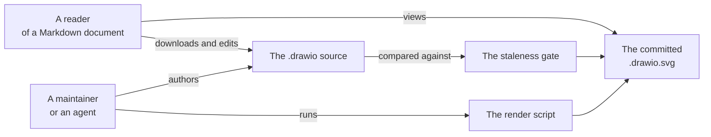

# System context

```mermaid
flowchart LR
    Reader["A reader\nof a Markdown document"] -->|"views"| Artifact["The committed\n.drawio.svg"]
    Maintainer["A maintainer\nor an agent"] -->|"authors"| Source["The .drawio source"]
    Maintainer -->|"runs"| Render["The render script"]
    Render --> Artifact
    Source -->|"compared against"| Gate["The staleness gate"]
    Gate --> Artifact
    Reader -->|"downloads and edits"| Source
```

The reader and the maintainer are the two people the skill serves. The artifact sits between them, and the gate keeps the two sides of it honest.
